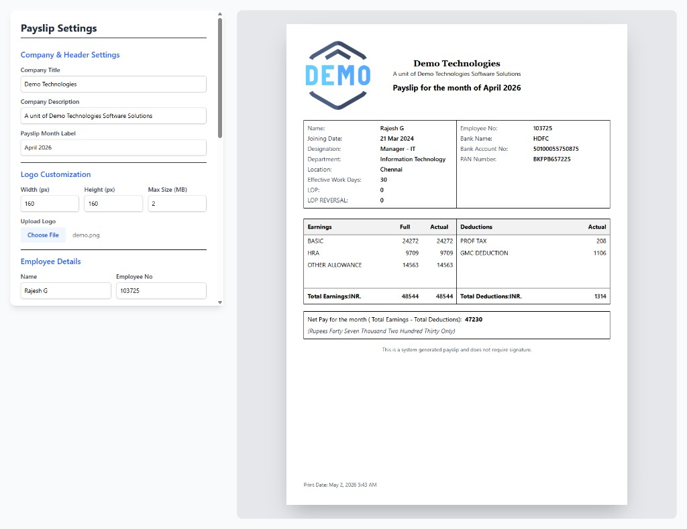

# Payslip Generator

A single-page web app to customize company branding and employee payroll details, preview an **A4-style payslip** in real time, and **download it as a PDF**.



## Features

- **Company & header** — Title, description, and payslip month label  
- **Logo** — Upload an image with configurable width/height and max file size  
- **Employee & bank** — Name, ID, dates, designation, department, location, attendance (work days, LOP), bank and PAN  
- **Payroll** — Basic, HRA, other allowance; professional tax and GMC deduction  
- **Totals** — Net pay with **Indian numbering** (lakh/crore) amount in words  
- **Export** — One-click **Download PDF** (preview rendered via HTML capture)

## Tech stack

| Layer | Choice |
|--------|--------|
| UI | [React](https://react.dev/) |
| Forms | [react-hook-form](https://react-hook-form.com/) |
| Styling | [Tailwind CSS](https://tailwindcss.com/) v4 |
| PDF pipeline | [html2canvas](https://html2canvas.hertzen.com/) + [jsPDF](https://github.com/parallax/jspdf) |
| Tooling | [Vite](https://vitejs.dev/), ESLint |

## Prerequisites

- **Node.js** 18+ (20+ recommended)
- **npm** (comes with Node)

## Getting started

```bash
git clone https://github.com/BharathKumar-c/payslip-generator.git
cd payslip-generator
npm install
npm run dev
```

Open the URL shown in the terminal (usually `http://localhost:5173`).

### Scripts

| Command | Description |
|---------|-------------|
| `npm run dev` | Start dev server with hot reload |
| `npm run build` | Production build to `dist/` |
| `npm run preview` | Serve the production build locally |
| `npm run lint` | Run ESLint |

## Using the app

1. Fill **Payslip Settings** on the left (company, logo, employee, bank, earnings & deductions).  
2. Check the **preview** on the right — it updates as you type.  
3. Click **Download PDF** to save a payslip named like `Payslip_<EmployeeName>.pdf`.

## Project structure

```
payslip-generator/
├── public/           # Static assets (favicon, icons)
├── src/
│   ├── App.jsx       # Main UI, calculations, PDF export
│   ├── main.jsx      # React entry
│   └── index.css     # Tailwind import + theme tweaks for PDF compatibility
├── docs/
│   └── screenshot.png
├── index.html
├── vite.config.js
└── package.json
```

## License

This project is provided as-is for personal or internal use. Add a license file if you redistribute the code.

---

**Repository:** [github.com/BharathKumar-c/payslip-generator](https://github.com/BharathKumar-c/payslip-generator)
